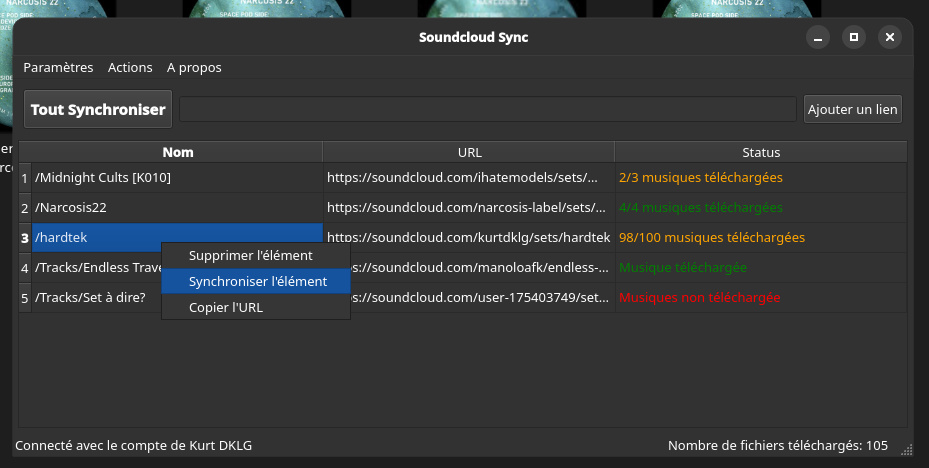
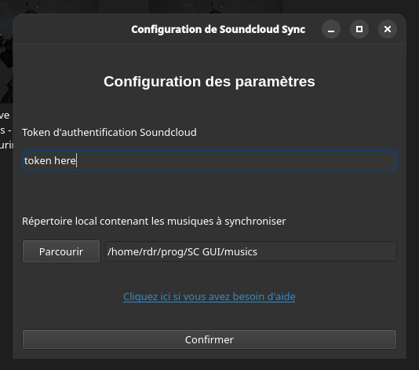

# Soundcloud Sync

> **Synchroniser vos playlistes, musiques et artistes Soundcloud sur votre PC**

## Fonctionnement et options:

**Ajoutez un lien Soundcloud (playliste, album, musique, utilisateur) à votre liste d'éléments à synchroniser.
Dans le répertoire local choisi, les contenus Soundcloud ajoutés seront téléchargés en gardant les métadonnées.**

La colonne Status indique l'état de téléchargement du contenu soundcloud.
Chaque dossier de synchronisation est indépendant et contient un fichier JSON avec tous les liens soundcloud ajoutés.

En synchronisant un élément, les titres manquants sont téléchargés.
Si le paramètre n'est pas désactivé, les titres téléchargés qui ne sont plus dans la playliste/album distant sont supprimés.

## Installation:

Vous avez besoin de `Python 3.9` minimum et de `ffmpeg`.

Pour installer `ffmpeg` sur Windows, utilisez cette commande: `winget ffmpeg`
Sur Linux, utilisez votre gestionnaire de paquet.

Un éxécutable .exe est disponible pour Windows. Sinon:

Pour installer les dépendances, entrez cette commande dans le répertoire du projet.

    python -m pip install -r requirements.txt

Pour lancer le programme:

    python "soundcloud sync.py"

## Paramètres:

#### Token Soundcloud
Vous devez entrer votre Token d'authentification Soundcloud pour pouvoir télécharger les musiques:
Vous trouverez votre token dans les cookies Soundcloud
(Connectez-vous à soundcloud.com > appuyez sur F12 > onglet Application > cookies > Value de `oauth_token`).

#### Répertoire de synchronisation
Vous devez spécifier le chemin du répertoire dans lequel sera téléchargé les musiques.
Choisissez un dossier vide, par exemple `Musiques/Soundcloud/`

## Notes:

Désactiver les services de synchronisation de fichier comme OneDrive et ne pas convertir les fichiers au format MP3
sont des moyens d'accélérer le téléchargement des contenus.

Si l'installation des dépendances du requirements.txt échoue avec une version récente de Python, essayez d'utiliser `Python 3.9`.

Sur Windows, certains bugs liés au format des noms de fichiers peuvent affecter l'affichage du status de synchronisation d'un élément.
Voir les caractères interdits dans les noms de fichier Windows.